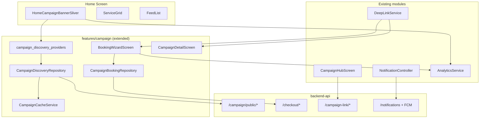
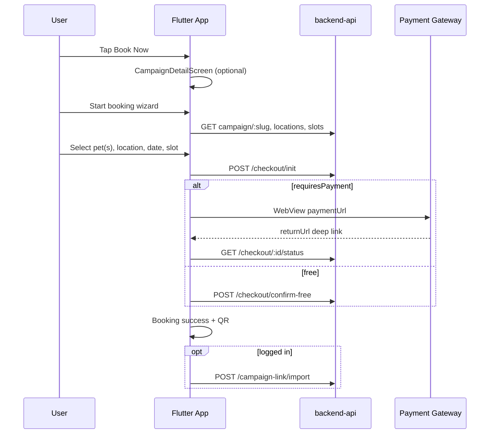
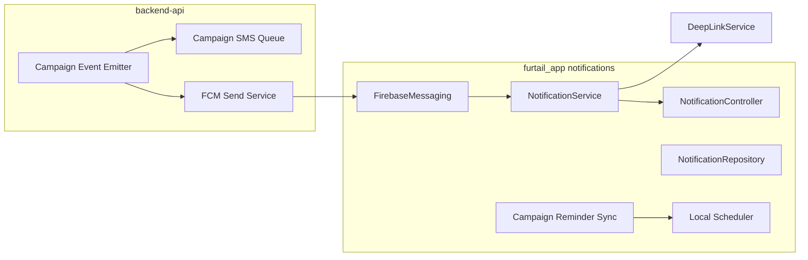

# Furtail Cat Flu & Rabies Vaccination Campaign System — Mobile Implementation Plan

**Project:** `furtail_app` (Flutter)  
**Related:** `backend-api`, `vaccination_2026` (web booking reference), `bpa_web` (admin)  
**Document type:** Implementation plan only — **no code in this phase**  
**Date:** 2026-06-05  
**Status:** Draft for review

---

## Table of contents

1. [Executive summary](#1-executive-summary)
2. [Current state analysis](#2-current-state-analysis)
3. [Requirements traceability](#3-requirements-traceability)
4. [System architecture](#4-system-architecture)
5. [Feature 1 — Home screen campaign banner](#5-feature-1--home-screen-campaign-banner)
6. [Feature 2 — Dynamic campaign system](#6-feature-2--dynamic-campaign-system)
7. [Feature 3 — In-app booking flow](#7-feature-3--in-app-booking-flow)
8. [Feature 4 — Notification architecture](#8-feature-4--notification-architecture)
9. [Feature 5 — Home screen priority & placement](#9-feature-5--home-screen-priority--placement)
10. [Feature 6 — Premium design specification](#10-feature-6--premium-design-specification)
11. [Feature 7 — Offline handling & resilience](#11-feature-7--offline-handling--resilience)
12. [Feature 8 — Analytics](#12-feature-8--analytics)
13. [Feature 9 — API integration & gaps](#13-feature-9--api-integration--gaps)
14. [Data models (Flutter)](#14-data-models-flutter)
15. [File & module touch points](#15-file--module-touch-points)
16. [Phased delivery roadmap](#16-phased-delivery-roadmap)
17. [Testing strategy](#17-testing-strategy)
18. [Risks, dependencies & open decisions](#18-risks-dependencies--open-decisions)
19. [Acceptance criteria](#19-acceptance-criteria)

---

## 1. Executive summary

The Furtail Flutter app already ships a **post-booking vaccination campaign module** (`lib/features/campaign/`) covering digital health records, certificates, QR, import/linking, and local vaccination reminders. It does **not** yet support:

- Home-screen campaign discovery banner
- In-app booking creation (pet/location/date/slot/payment)
- Server-driven campaign push notifications
- Campaign data/image offline cache

The backend (`backend-api`) already exposes a **mature public campaign API** used by the `vaccination_2026` Next.js site: campaign listing, discovery, express checkout, slots, locations, coupons, and payment redirects. Admin management exists in `bpa_web`.

**Recommended approach:** Extend the existing `campaign` feature slice rather than creating a parallel module. Mirror the web **express checkout** flow for booking parity, add a **mobile-optimized banner layer** on the home screen, and build **notification + analytics** extensions on top of the existing `notifications` and `analytics` infrastructure.

**Estimated delivery:** 4 phases over ~6–8 weeks (see [§16](#16-phased-delivery-roadmap)).

---

## 2. Current state analysis

### 2.1 Flutter app (`furtail_app`)

| Area | Current state | Gap |
|------|---------------|-----|
| **Home screen** | `FurtailHomeScreen` → `HomeContentAssembly`: floating `SliverAppBar` (HomeAppBar) → StorySection → ServiceGrid → FeedList | No campaign banner sliver |
| **Campaign entry** | Service grid tile + drawer → `CampaignHubScreen` (post-booking hub) | No “Book Now” from home |
| **Campaign API usage** | `campaign-link/*` only via `CampaignRepository` | `campaignPublicCampaigns()` defined in `api_endpoints.dart` but **unused** |
| **Booking** | Read-only `CampaignBooking` models + `BookingTile` | No checkout/OTP/slot/payment methods |
| **Pet selection** | Pet wizard + `_PetPicker` in digital health card | No booking pet picker; `linkPet()` API has no UI |
| **Payment** | Wallet withdraw only; fundraising donate stub | No campaign pay-in |
| **Notifications** | FCM + local channels; `syncVaccinationReminders()` from local storage | No campaign-specific push types; inbox UI placeholder |
| **Analytics** | `campaign_registered`, `certificate_viewed`, `qr_viewed` | No banner/booking/payment funnel events |
| **Caching** | `cached_network_image` for media; SharedPreferences for auth/reminders | No campaign list/image cache |
| **Deep links** | `campaign/{id}` → hub | No `campaign/book/{slug}`, checkout success |

### 2.2 Backend (`backend-api`)

| Area | Status |
|------|--------|
| Public campaign CRUD read | ✅ `GET /campaign/public/campaigns`, `GET /campaign/public/campaigns/:slug` |
| Discovery | ✅ `/discovery/upcoming`, `/locator`, `/schedule`, `/live-stats` |
| Express checkout | ✅ `POST /checkout/init`, status polling, free confirm |
| OTP legacy booking | ✅ `/auth/request-otp`, `/booking/` (full pet details + slot) |
| Slots & locations | ✅ Public + admin |
| Post-booking link | ✅ `/campaign-link/*` |
| Admin | ✅ Full lifecycle in `/campaign/admin/*` via `bpa_web` |
| Campaign hero/banner image | ⚠️ No first-class DB field; `metadataJson` used ad hoc |
| Mobile banner API | ❌ Not dedicated |
| FCM campaign notifications | ❌ SMS only for reminders; general `/notifications` not campaign-wired |
| Device token API | ⚠️ Flutter calls `POST /me/device-tokens` (may fail silently until backend ready) |

### 2.3 Web reference (`vaccination_2026`)

The web booking wizard (`components/booking/BookingWizard.tsx`) implements:

1. Load campaign by slug
2. Collect contact + location (venue / Dhaka corp / coverage zone) + cat count
3. `POST /checkout/init` → payment redirect or free confirm
4. Success with booking ref + QR

**Mobile should align with this flow** unless product explicitly chooses the heavier OTP + per-pet-detail legacy path.

---

## 3. Requirements traceability

| # | Requirement | Plan section | Phase |
|---|-------------|--------------|-------|
| R1 | Home campaign banner (image, title, desc, date, location, price, CTA) | [§5](#5-feature-1--home-screen-campaign-banner) | 1 |
| R2 | Dynamic campaigns from API; admin activate/deactivate/content/price/locations | [§6](#6-feature-2--dynamic-campaign-system) | 1–2 |
| R3 | Booking: pet, location, date, slot, payment, create booking | [§7](#7-feature-3--in-app-booking-flow) | 2–3 |
| R4 | Notification types (9 listed) | [§8](#8-feature-4--notification-architecture) | 3–4 |
| R5 | Banner above feed, below header | [§9](#9-feature-5--home-screen-priority--placement) | 1 |
| R6 | Premium design (gradient, badges, slots indicator) | [§10](#10-feature-6--premium-design-specification) | 1–2 |
| R7 | Offline cache + retry | [§11](#11-feature-7--offline-handling--resilience) | 2 |
| R8 | Analytics (impressions, clicks, booking/payment conversion) | [§12](#12-feature-8--analytics) | 2–3 |
| R9 | API review + missing endpoints | [§13](#13-feature-9--api-integration--gaps) | 1–4 |

---

## 4. System architecture

### 4.1 High-level component diagram



### 4.2 Layering (follow existing conventions)

```
lib/features/campaign/
├── data/
│   ├── models/
│   │   ├── campaign_models.dart          # extend existing
│   │   ├── campaign_discovery_models.dart # NEW
│   │   └── campaign_booking_draft.dart    # NEW
│   ├── repositories/
│   │   ├── campaign_repository.dart       # keep post-booking
│   │   ├── campaign_discovery_repository.dart  # NEW
│   │   └── campaign_booking_repository.dart    # NEW
│   └── services/
│       ├── campaign_cache_service.dart    # NEW
│       └── reminder_storage.dart          # existing
└── presentation/
    ├── providers/
    │   ├── campaign_providers.dart        # existing
    │   ├── campaign_discovery_providers.dart  # NEW
    │   └── campaign_booking_providers.dart    # NEW
    ├── screens/
    │   ├── campaign_detail_screen.dart    # NEW
    │   ├── campaign_booking_wizard_screen.dart  # NEW
    │   ├── campaign_payment_webview_screen.dart # NEW
    │   └── ... (existing hub/records screens)
    └── widgets/
        ├── home_campaign_banner.dart      # NEW
        ├── home_campaign_banner_carousel.dart  # NEW (multi-campaign)
        ├── campaign_price_badge.dart      # NEW
        └── ... (existing tiles)
```

**State management:** Riverpod (`FutureProvider`, `AsyncNotifierProvider`) — consistent with `campaign_providers.dart` and `notification_controller.dart`.

**Networking:** Extend `ApiEndpoints` + use existing `ApiClient` (`services/api_client.dart`). Public discovery endpoints use `auth: false`; post-booking continues `auth: true`.

---

## 5. Feature 1 — Home screen campaign banner

### 5.1 User experience

- One or more **premium campaign cards** appear on the home tab immediately below `HomeAppBar`, above `StorySection`.
- Each card shows: hero image, title, short description, date range, primary location label, formatted price, remaining slots (when API provides), official Furtail badge, vaccine icon, **Book Now** CTA.
- Multiple active campaigns → horizontal `PageView` carousel with page indicators; single campaign → full-width card.
- Tap card body → `CampaignDetailScreen`; tap CTA → booking wizard (or detail if guest needs context first).
- Pull-to-refresh on home re-fetches campaigns (respecting cache TTL).

### 5.2 Data source strategy

**Primary (Phase 1):** Compose banner from existing public APIs:

| Field | Source |
|-------|--------|
| Title, description, dates, price | `GET /api/v1/campaign/public/campaigns` |
| Remaining slots, next slot | `GET /api/v1/campaign/public/discovery/upcoming?window=this_week` |
| Full detail + config | `GET /api/v1/campaign/public/campaigns/:slug` |
| Live stats (optional) | `GET /api/v1/campaign/public/discovery/live-stats?slug=` |
| Hero image | **Gap** — see [§13.3](#133-recommended-new-backend-endpoints); interim: `metadataJson.mobileBannerUrl` or static asset keyed by slug |

**Sort/priority rules:**

1. `status === ACTIVE` && `visibility === PUBLIC` (server-filtered)
2. Prefer campaigns with `remainingCapacity > 0`
3. Nearest `nextSlotDate` ascending
4. Admin `featuredOnMobile` flag when backend adds it (Phase 2)

### 5.3 Widget specification

**New widget:** `HomeCampaignBanner` (sliver-compatible wrapper `HomeCampaignBannerSliver`)

**Props / state:**

- `List<CampaignBannerItem> campaigns`
- `bool isLoading`, `bool isStale` (showing cache)
- `VoidCallback onRetry`

**Integration point:** `HomeContentAssembly.build()` — insert new sliver between `SliverAppBar` and `SliverToBoxAdapter` (StorySection block):

```dart
// Proposed order in CustomScrollView slivers:
// 1. SliverAppBar (HomeAppBar)          ← existing
// 2. HomeCampaignBannerSliver           ← NEW
// 3. SliverToBoxAdapter (StorySection)  ← existing
// 4. ServiceGrid, divider, feed...      ← existing
```

**Provider:** `homeCampaignBannersProvider` — watches `campaignDiscoveryRepository.fetchHomeBanners()`.

**Visibility rules:**

- Hide sliver when zero campaigns and not loading (no empty placeholder).
- Show skeleton shimmer while loading first fetch.
- Show compact “cached” indicator when offline/stale (optional subtitle).

---

## 6. Feature 2 — Dynamic campaign system

### 6.1 Admin capabilities (already in backend + bpa_web)

Admin actions map to existing backend; mobile consumes **read-only public** endpoints:

| Admin action | Backend mechanism | Mobile effect |
|--------------|-------------------|---------------|
| Activate campaign | `POST /campaign/admin/campaigns/:id/activate` | Appears in `GET /public/campaigns` |
| Deactivate / pause | `pause`, `cancel` lifecycle endpoints | Removed from public list |
| Change text | `PATCH /campaign/admin/campaigns/:id` (`name`, `description`) | Banner copy updates on next fetch |
| Change price | PATCH pricing fields + `CampaignConfig` | Price badge updates |
| Change locations | Admin location CRUD | Location label + booking picker options |
| Change image | **Needs** `metadataJson.mobileBannerUrl` or new media field | Banner image updates |

**No mobile admin UI required** for v1 — admin continues using `bpa_web` campaign admin (`/admin/campaigns/*`).

### 6.2 Mobile refresh behavior

| Trigger | Action |
|---------|--------|
| App cold start | Fetch campaigns; fall back to cache if network fails |
| Home pull-to-refresh | Force network fetch; update cache |
| App resume (optional Phase 2) | Refresh if cache age > TTL |
| Push `campaign_update` notification | Invalidate cache + refresh provider |

**Cache TTL default:** 15 minutes (configurable via `AppConfig`).

### 6.3 Multi-campaign support

- `fetchHomeBanners()` returns `List<CampaignBannerItem>` (0..N).
- Carousel auto-advance optional (disabled by default for accessibility).
- Impression analytics fire **per visible card** (debounced when swiping carousel).

---

## 7. Feature 3 — In-app booking flow

### 7.1 Flow overview



### 7.2 Recommended booking path: Express checkout (web parity)

Align with `vaccination_2026` for maintainability. Steps:

| Step | Screen / component | API |
|------|-------------------|-----|
| 0 | Campaign detail (marketing + vaccines + pricing breakdown) | `GET /public/campaigns/:slug` |
| 1 | **Pet selection** | See [§7.3](#73-pet-selection-strategy) |
| 2 | **Location** | Venue list OR Dhaka corp / coverage zone (same branching as web) |
| 3 | **Date & slot** | `GET /public/locations/:id/slots?startDate&endDate` or availability |
| 4 | **Contact confirm** | Pre-fill from profile if logged in (phone, name) |
| 5 | **Payment summary** | Coupon validate, price breakdown |
| 6 | **Payment** | WebView or external browser for `paymentUrl` |
| 7 | **Success** | Show `bookingRef`, QR, add to My Campaigns |

**Draft persistence:** `SharedPreferences` key `campaign_booking_draft_v1` (mirrors web `sessionStorage` pattern in `BookingWizard.tsx`).

### 7.3 Pet selection strategy

**Product tension:** Web express flow uses **cat count** (1–10), not named pets. Requirement asks for **pet selection**.

**Recommended hybrid (v1):**

| User state | Behavior |
|------------|----------|
| **Logged in with pets** | Multi-select from user's Furtail pets; `catCount = selected.length`; store pet IDs in draft for post-booking `linkPet` |
| **Logged in, no pets** | Cat count stepper (1..maxCats) + prompt to add pet profile after booking |
| **Guest** | Cat count stepper; phone OTP optional for claim later |

**Post-booking linking:** After success, if user logged in and selected Furtail pets, call `POST /campaign-link/import` then map campaign pets to Furtail pets via `POST /campaign-link/pet/:campaignPetId` (new UI in success screen).

**Alternative (Phase 3+):** Implement OTP legacy flow (`POST /campaign/booking/`) for per-pet name/breed/age at booking time — heavier UX, only if operations require it.

### 7.4 Location & slot selection

Reuse web branching logic (port from `vaccination_2026/lib/bookingValidation.ts` and step components):

1. **Venue mode** — `GET /public/campaigns/:slug/locations?onlyAvailable=true`
2. **Dhaka metro** — `GET /public/dhaka/city-corporations`, booking areas
3. **Coverage zone** — `GET /public/coverage-zones`, `/:zoneId/bd-areas`
4. **Rollout area** — `GET /public/campaigns/:slug/booking-areas` + full address

**Slots:** When `config.slotRequired === true`, require slot pick from `GET /public/locations/:locationId/slots`.

**Zone interest bookings:** Handle `bookingMode: ZONE_INTEREST`, `pendingAssignment: true`, nullable `location`/`slot` in Flutter models (fix current `CampaignBooking` assumption that location always exists).

### 7.5 Payment integration

**Phase 2 approach (recommended):** In-app **WebView** (`webview_flutter` — add dependency) loading `paymentUrl` from checkout init.

| Concern | Solution |
|---------|----------|
| Return URLs | Pass mobile deep links: `furtail://campaign/checkout/success?checkoutId=` and `furtail://campaign/checkout/failed?checkoutId=` |
| Status polling | `GET /public/checkout/:checkoutId/status` every 2s until terminal state (max 2 min) |
| Free campaigns | `POST /public/checkout/confirm-free` |
| Pay at venue | When `payAtVenueEnabled`, skip WebView; confirm booking directly |

**Phase 3 alternative:** External browser via `url_launcher` + deep link return (simpler, worse UX).

**Coupon:** `POST /public/coupons/validate` before init.

### 7.6 Navigation & routes

Add to `app_routes.dart` / `app_router.dart`:

| Route | Purpose |
|-------|---------|
| `/campaign/detail` | Args: `slug` |
| `/campaign/book` | Args: `slug`, optional draft restore |
| `/campaign/checkout/success` | Args: `checkoutId` or `bookingRef` |
| `/campaign/checkout/failed` | Args: `checkoutId`, error |

Extend `DeepLinkParser` for:

- `campaign/book/{slug}`
- `campaign/checkout/success`
- `campaign/booking/{ref}`

### 7.7 Connection to existing hub

After booking success:

- Navigate to enhanced success screen with QR (reuse `QrViewerScreen` patterns)
- CTA: “View in My Campaigns” → `MyCampaignsScreen`
- If logged in: auto-trigger `importRecords()` when phone matches

---

## 8. Feature 4 — Notification architecture

### 8.1 Current foundation

Documented in `docs/mobile/notification_system.md`:

- `NotificationService` — FCM + local notifications
- `NotificationController` — Riverpod bootstrap
- `AppNotificationType` — 11 types today (includes `campaignReminder`, `vaccineReminder`)
- Campaign module syncs **local** vaccination reminders from `ReminderStorage`

### 8.2 Required notification types — mapping

| Requirement | Delivery | Trigger | `AppNotificationType` (new/extended) |
|-------------|----------|---------|--------------------------------------|
| New Campaign | Push (FCM) | Admin activates / publishes campaign | `campaignNew` |
| Campaign Starting Soon | Push + local schedule | T-24h / T-2h before campaign `startDate` | `campaignStartingSoon` |
| Today's Campaign | Push + local | Morning of days with user booking or nearby slot | `campaignToday` |
| Nearby Campaign | Push | Geo-fenced discovery (user lat/lng + locator API) | `campaignNearby` |
| Booking Confirmed | Push | Checkout fulfilled / webhook | `campaignBookingConfirmed` |
| Vaccination Reminder | Local (+ push optional) | 24h before appointment | `campaignReminder` (existing) |
| Second Dose Reminder | Local (+ push optional) | `nextDueDate` from vaccination record | `vaccineReminder` (existing) |
| Campaign Update | Push | Admin changes slot/venue/schedule | `campaignUpdate` |
| Campaign Cancelled | Push | Admin cancels campaign/booking | `campaignCancelled` |

### 8.3 Architecture layers



### 8.4 Client implementation plan

**A. Extend `AppNotificationType`** (`notification_type.dart`):

Add codes: `campaign_new`, `campaign_starting_soon`, `campaign_today`, `campaign_nearby`, `campaign_booking_confirmed`, `campaign_update`, `campaign_cancelled`.

**B. Notification channels** (`notification_channels.dart`):

One Android channel per campaign category; campaign announcements use `bpa_announcement` or dedicated `bpa_campaign` channel.

**C. FCM payload contract** (extend `docs/mobile/notification_system.md`):

```json
{
  "type": "campaign_booking_confirmed",
  "title": "Booking confirmed",
  "body": "Your vaccination is scheduled for 12 Jun, 10:00 AM",
  "actionUrl": "campaign/booking/VC-2026-ABC123",
  "campaignId": "42",
  "campaignSlug": "cat-flu-rabies-dhaka-2026",
  "bookingRef": "VC-2026-ABC123"
}
```

**D. Local scheduling (client-side, Phase 3):**

| Reminder | Source | Scheduler |
|----------|--------|-----------|
| Vaccination reminder | `GET /campaign-link/upcoming` + local prefs | `NotificationService.scheduleCampaignReminder` |
| Second dose | `GET /campaign-link/vaccinations` (`nextDueDate`) | Existing `syncVaccinationReminders` |
| Campaign starting soon | Cached campaign `startDate` | New `scheduleCampaignCountdownReminders` |

**E. Nearby campaigns (Phase 4):**

- Request location permission (reuse `features/location/` if present)
- Periodic or on-geo-fence: `GET /discovery/locator?district=...`
- Rate-limit local notifications (max 1/week per slug)

**F. In-app notification inbox (Phase 4):**

Wire drawer “Notifications” to list screen using existing API endpoints (`notificationsList` in `api_endpoints.dart`) — currently placeholder snackbar in home drawer.

### 8.5 Backend work required (see [§13](#13-feature-9--api-integration--gaps))

- Campaign event hooks → FCM topic or per-device send
- Device token registration (`POST /me/device-tokens`) — verify/implement
- Optional: user preference flags for campaign push opt-out

---

## 9. Feature 5 — Home screen priority & placement

### 9.1 Visual hierarchy

```
┌─────────────────────────────────────┐
│ HomeAppBar (floating, snap)         │  ← pinned behavior unchanged
├─────────────────────────────────────┤
│ ★ CAMPAIGN BANNER (NEW)             │  ← highest content priority
│   [hero image | gradient | CTA]     │
├─────────────────────────────────────┤
│ StorySection                        │
│ ServiceGrid (incl. Vaccination)     │
│ ─── divider ───                     │
│ FeedList                            │
└─────────────────────────────────────┘
```

### 9.2 UX rules

- Banner height: ~200–240 logical px (responsive; min 180 on small phones)
- Campaign banner **never** below ServiceGrid (requirement: above normal content)
- Do not remove ServiceGrid vaccination tile — banner is additive discovery
- Logged-out users see banner and can book (phone at checkout); logged-in get pre-fill + import

### 9.3 Accessibility

- Semantics label: “Vaccination campaign: {title}. Book now.”
- CTA minimum touch target 48×48
- Sufficient contrast on gradient overlay (WCAG AA)
- Carousel: swipe + visible page dots; respect `Reduce motion`

---

## 10. Feature 6 — Premium design specification

### 10.1 Design tokens (use existing)

From `core/theme/furtail_design_tokens.dart`, `app_theme.dart`, `app_colors.dart`:

- Card radius: **16px** (match feed cards)
- Primary CTA: `AppPrimaryButton` or filled button with `colorScheme.primary`
- Gold accent: `FurtailDesignTokens.accentGold` for price badge
- Success green for “slots available”

### 10.2 Campaign banner visual spec

| Element | Spec |
|---------|------|
| **Container** | Full-width minus 16px horizontal margin; border-radius 20px; elevation 0 with subtle shadow |
| **Hero image** | `AspectRatio` ~16:9 top; `CachedNetworkImage` + placeholder gradient |
| **Gradient overlay** | Linear: transparent → `Color(0xCC0A1628)` bottom 60% |
| **Vaccine icon** | Top-left badge circle, `Icons.medical_services_outlined` or custom SVG |
| **Official Furtail badge** | Top-right “Furtail Official” pill, white/10 background |
| **Title** | `titleLarge`, white, max 2 lines |
| **Description** | `bodySmall`, white 85%, max 2 lines |
| **Date row** | Calendar icon + formatted range (`intl` date formatting, en/bn via l10n) |
| **Location row** | Pin icon + primary location or “Multiple locations” |
| **Price badge** | Bottom-left pill: “৳{amount}” or “Free”; gold border if paid |
| **Slots indicator** | Bottom-right: “{n} slots left” when `showRemainingSlots` && n > 0; “Almost full” when n ≤ 5 |
| **CTA** | Full-width “Book Now” / localized equivalent below image block OR overlaid bottom-right |

### 10.3 Campaign detail page

- Collapsing hero with same image treatment
- Sections: vaccines included, pricing breakdown, locations map preview (static list v1), trust strip, FAQ accordion (from benefits API or static l10n)
- Sticky bottom bar: price + Book Now

### 10.4 Localization

Add strings to `lib/l10n/app_en.arb` and `app_bn.arb`:

- `campaignBookNow`, `campaignSlotsLeft`, `campaignOfficialBadge`, booking step titles, notification titles

---

## 11. Feature 7 — Offline handling & resilience

### 11.1 Campaign data cache

**New service:** `CampaignCacheService`

| Key | Storage | Content |
|-----|---------|---------|
| `campaign_home_banners_v1` | SharedPreferences (JSON) | List of `CampaignBannerItem` + `fetchedAt` |
| `campaign_detail_{slug}_v1` | SharedPreferences | Full campaign detail |
| Hero images | `flutter_cache_manager` / default cache | Binary via `CachedNetworkImage` |

**TTL:** 15 min banners, 60 min detail (configurable).

**Stale-while-revalidate:** Show cache immediately; fetch in background; swap on success.

### 11.2 Retry policy

Use exponential backoff in repository layer:

| Attempt | Delay |
|---------|-------|
| 1 | immediate |
| 2 | 2s |
| 3 | 5s |
| fail | show cached + “Tap to retry” on banner |

Integrate with home `RefreshIndicator` (already increments `_homeRefreshToken`).

### 11.3 Offline booking

**Booking creation requires network** — show blocking message if offline at checkout. Draft saved locally so user can resume when online.

### 11.4 No new DB dependency

Avoid Hive/SQLite for v1 — SharedPreferences + image cache sufficient per existing app patterns.

---

## 12. Feature 8 — Analytics

### 12.1 New events (`analytics_events.dart`)

| Event name | When | Parameters |
|------------|------|------------|
| `campaign_banner_impression` | Banner visible ≥1s (VisibilityDetector) | `campaign_id`, `campaign_slug`, `position`, `source=home` |
| `campaign_banner_click` | Tap card (not only CTA) | `campaign_id`, `campaign_slug`, `target=detail\|book` |
| `campaign_booking_started` | Enter wizard step 1 | `campaign_slug`, `auth_state` |
| `campaign_booking_step` | Each step complete | `campaign_slug`, `step`, `step_name` |
| `campaign_booking_completed` | Success screen | `campaign_slug`, `booking_ref`, `cat_count`, `amount` |
| `campaign_payment_started` | WebView opens | `campaign_slug`, `checkout_id`, `amount`, `method` |
| `campaign_payment_completed` | Status = PAID | `campaign_slug`, `checkout_id`, `amount`, `method` |
| `campaign_payment_failed` | Status = FAILED | `campaign_slug`, `checkout_id`, `error_code` |

**Naming:** ≤40 chars, snake_case — follow existing catalog in `docs/mobile/analytics_events.md`.

### 12.2 Funnel definition

```
impression → click → booking_started → booking_step (location) → booking_step (slot)
  → payment_started → payment_completed → booking_completed
```

Report conversion rates in Firebase Analytics explorations.

### 12.3 Implementation hooks

| Location | Event |
|----------|-------|
| `HomeCampaignBanner` | impression, click |
| `CampaignBookingWizardScreen` | started, step, completed |
| `CampaignPaymentWebViewScreen` | payment started/completed/failed |
| Existing `CampaignHubScreen` import | keep `campaign_registered` |

---

## 13. Feature 9 — API integration & gaps

### 13.1 Existing endpoints — mobile usage plan

#### Discovery & banner (public, no auth)

| Method | Path | Mobile use |
|--------|------|------------|
| GET | `/api/v1/campaign/public/campaigns` | Home banner list |
| GET | `/api/v1/campaign/public/campaigns/:slug` | Detail + config + pricing |
| GET | `/api/v1/campaign/public/campaigns/:slug/countdown` | Countdown on detail/banner |
| GET | `/api/v1/campaign/public/discovery/upcoming?window=this_week` | Slots + remaining capacity |
| GET | `/api/v1/campaign/public/discovery/live-stats?slug=` | Social proof counters |
| GET | `/api/v1/campaign/public/campaigns/:slug/locations` | Location picker |
| GET | `/api/v1/campaign/public/locations/:locationId/slots` | Slot picker |
| GET | `/api/v1/campaign/public/dhaka/city-corporations` | Dhaka flow |
| GET | `/api/v1/campaign/public/coverage-zones` | Zone flow |
| GET | `/api/v1/campaign/public/campaigns/:slug/booking-areas` | Rollout areas |
| POST | `/api/v1/campaign/public/coupons/validate` | Coupon field |

#### Booking & payment (public)

| Method | Path | Mobile use |
|--------|------|------------|
| POST | `/api/v1/campaign/public/checkout/init` | Create checkout session |
| POST | `/api/v1/campaign/public/checkout/confirm-free` | Free campaigns |
| GET | `/api/v1/campaign/public/checkout/:checkoutId/status` | Poll payment |
| POST | `/api/v1/campaign/public/booking/claim` | Guest claim by phone |

#### Post-booking (auth — existing)

| Method | Path | Mobile use |
|--------|------|------------|
| GET | `/api/v1/campaign-link/my-bookings` | My Campaigns |
| POST | `/api/v1/campaign-link/import` | Link after booking |
| POST | `/api/v1/campaign-link/pet/:id` | Link pet profiles |
| GET | `/api/v1/campaign-link/upcoming` | Reminder sync |

### 13.2 ApiEndpoints additions (Flutter)

Add to `lib/core/network/api_endpoints.dart`:

```dart
// Public discovery
static String campaignPublicCampaignBySlug(String slug) => ...
static String campaignPublicCountdown(String slug) => ...
static String campaignDiscoveryUpcoming({String window = 'this_week'}) => ...
static String campaignDiscoveryLiveStats({String? slug}) => ...
static String campaignPublicLocations(String slug) => ...
static String campaignPublicLocationSlots(int locationId) => ...
static String campaignPublicDhakaCorps() => ...
static String campaignPublicCoverageZones() => ...
static String campaignPublicBookingAreas(String slug) => ...
static String campaignCheckoutInit() => ...
static String campaignCheckoutStatus(String checkoutId) => ...
static String campaignCheckoutConfirmFree() => ...
static String campaignCouponValidate() => ...
```

### 13.3 Recommended new backend endpoints

| Priority | Endpoint | Purpose |
|----------|----------|---------|
| **P0** | Extend `GET /public/campaigns` response with `mobileBanner: { imageUrl, thumbnailUrl, ctaLabel, featuredPriority }` | Admin-controlled banner without app release |
| **P0** | Verify/implement `POST /api/v1/me/device-tokens` | FCM registration |
| **P1** | `GET /public/campaigns/mobile-home` | Single aggregated DTO: campaigns + slots + images + stats (reduces mobile round-trips) |
| **P1** | Campaign FCM event emitter on: activate, booking confirmed, venue assigned, cancel | Push notifications |
| **P2** | `GET /public/campaigns/nearby?lat=&lng=&radiusKm=` | Nearby campaign push targeting |
| **P2** | User notification preferences: `campaignPushEnabled` | Opt-out |

**Image storage:** Store `mobileBannerUrl` in `Campaign.metadataJson`:

```json
{
  "mobile": {
    "bannerImageUrl": "https://cdn.../campaigns/slug/banner.jpg",
    "featuredPriority": 10,
    "shortDescription": "Optional override for mobile"
  }
}
```

Admin UI addition in `bpa_web` campaign edit form (Phase 2 backend).

### 13.4 Model fixes required (Flutter)

Update `CampaignBooking.fromJson`:

- `locationName` nullable when `pendingAssignment`
- Parse `bookingMode`, `pendingAssignment`, `coverageZoneName`, `bookingArea`
- Handle `petCount` when `pets` array empty

### 13.5 Rate limits to surface in UI

| Endpoint | Limit | User message |
|----------|-------|--------------|
| Checkout init | 3/hour/phone | “Too many attempts. Try again later.” |
| OTP request | 3/min/phone | “Wait before requesting another code.” |
| Booking claim | 5/15min | “Too many claim attempts.” |

---

## 14. Data models (Flutter)

### 14.1 New: `CampaignBannerItem`

```dart
class CampaignBannerItem {
  final int id;
  final String slug;
  final String title;
  final String description;
  final DateTime startDate;
  final DateTime endDate;
  final String? primaryLocationLabel;
  final int locationCount;
  final CampaignPricingDisplay pricing;
  final int? remainingSlots;
  final String? nextSlotDate;
  final String? imageUrl;
  final bool showRemainingSlots;
  final bool bookingEnabled;
}
```

### 14.2 New: `PublicCampaignDetail`

Extends banner fields with: `config`, `includedVaccines`, `packageFeatureLines`, `locations[]`, `countdown`.

### 14.3 New: `CampaignBookingDraft`

```dart
class CampaignBookingDraft {
  final String slug;
  final int step;
  final List<int> selectedPetIds;
  final int catCount;
  final int? locationId;
  final int? coverageZoneId;
  final int? bdAreaId;
  final String? cityCorporationCode;
  final int? slotId;
  final String phone;
  final String ownerName;
  final String? couponCode;
  final String? paymentMethod;
}
```

### 14.4 New: `CheckoutInitResult`

Mirror TypeScript type from web `campaignApi.ts`.

---

## 15. File & module touch points

### 15.1 Flutter files to create

| File | Purpose |
|------|---------|
| `lib/features/campaign/data/models/campaign_discovery_models.dart` | Banner + public campaign DTOs |
| `lib/features/campaign/data/models/campaign_booking_draft.dart` | Wizard state |
| `lib/features/campaign/data/repositories/campaign_discovery_repository.dart` | Public API |
| `lib/features/campaign/data/repositories/campaign_booking_repository.dart` | Checkout API |
| `lib/features/campaign/data/services/campaign_cache_service.dart` | Cache layer |
| `lib/features/campaign/presentation/providers/campaign_discovery_providers.dart` | Riverpod |
| `lib/features/campaign/presentation/providers/campaign_booking_providers.dart` | Riverpod |
| `lib/features/campaign/presentation/widgets/home_campaign_banner.dart` | Banner UI |
| `lib/features/campaign/presentation/widgets/home_campaign_banner_carousel.dart` | Multi-campaign |
| `lib/features/campaign/presentation/widgets/campaign_price_badge.dart` | Shared badge |
| `lib/features/campaign/presentation/screens/campaign_detail_screen.dart` | Detail |
| `lib/features/campaign/presentation/screens/campaign_booking_wizard_screen.dart` | Wizard |
| `lib/features/campaign/presentation/screens/campaign_booking_success_screen.dart` | Success + QR |
| `lib/features/campaign/presentation/screens/campaign_payment_webview_screen.dart` | Payment |

### 15.2 Flutter files to modify

| File | Change |
|------|--------|
| `lib/features/home/presentation/screens/furtail_home_screen.dart` | Insert banner sliver in `HomeContentAssembly` |
| `lib/core/network/api_endpoints.dart` | New campaign public endpoints |
| `lib/features/campaign/data/models/campaign_models.dart` | Zone booking nullable fields |
| `lib/features/campaign/data/repositories/campaign_repository.dart` | Optional: delegate discovery |
| `lib/app/router/app_routes.dart` | New routes |
| `lib/app/router/app_router.dart` | Route handlers |
| `lib/core/deep_link/deep_link_parser.dart` | Booking deep links |
| `lib/core/deep_link/deep_link_navigator.dart` | Navigate to detail/wizard |
| `lib/core/analytics/analytics_events.dart` | New events |
| `lib/features/notifications/domain/notification_type.dart` | New types |
| `lib/features/notifications/data/notification_channels.dart` | Channels |
| `lib/l10n/app_en.arb`, `app_bn.arb` | Strings |
| `docs/mobile/analytics_events.md` | Document new events |
| `docs/mobile/notification_system.md` | Campaign payload types |

### 15.3 Backend files (coordination)

| File | Change |
|------|--------|
| `src/api/v1/modules/campaign/campaign.service.ts` | Serialize mobile banner from metadata |
| `src/api/v1/modules/campaign/campaign.controller.ts` | Optional `/mobile-home` handler |
| New: `campaign.notifications.service.ts` | FCM on campaign events |
| `prisma/schema.prisma` | Optional: formal `CampaignMedia` model (Phase 2) |
| `bpa_web` campaign admin form | Banner image upload field |

### 15.4 Dependencies (`pubspec.yaml`)

| Package | Purpose | Phase |
|---------|---------|-------|
| `webview_flutter` | Payment WebView | 2 |
| `visibility_detector` | Banner impressions | 1 |
| Existing: `cached_network_image`, `flutter_cache_manager` | Image cache | 1 |

---

## 16. Phased delivery roadmap

### Phase 1 — Discovery banner (2 weeks)

**Goal:** Visible home banner driven by API; detail screen read-only.

| Task | Owner |
|------|-------|
| `CampaignDiscoveryRepository` + cache | Mobile |
| `HomeCampaignBanner` + home integration | Mobile |
| `CampaignDetailScreen` | Mobile |
| ApiEndpoints + models | Mobile |
| Backend: expose `metadataJson.mobile.bannerImageUrl` in public serializer | Backend |
| Analytics: impression + click | Mobile |
| Unit tests: model parsing, cache TTL | Mobile |

**Exit criteria:** Active campaign appears on home; tap opens detail; offline shows cached banner; events in Firebase DebugView.

### Phase 2 — Booking wizard (2–3 weeks)

**Goal:** Complete booking without payment (free campaigns) + paid via WebView.

| Task | Owner |
|------|-------|
| Booking wizard steps (pet, location, date, slot) | Mobile |
| `CampaignBookingRepository` checkout integration | Mobile |
| Payment WebView + deep link return | Mobile |
| Draft persistence + model fixes for zone bookings | Mobile |
| Success screen + QR | Mobile |
| Analytics funnel events | Mobile |
| Backend: mobile return URL support in checkout | Backend |

**Exit criteria:** End-to-end free booking; paid booking via bKash/Nagad test mode; booking appears in My Campaigns after import.

### Phase 3 — Notifications & polish (1–2 weeks)

**Goal:** Push notifications for booking lifecycle + enhanced reminders.

| Task | Owner |
|------|-------|
| Extend notification types + deep link routing | Mobile |
| Backend FCM on booking confirmed / venue assigned / cancel | Backend |
| Device token API verification | Backend |
| Local reminder sync from upcoming API | Mobile |
| Pet linking UI on success screen | Mobile |
| l10n completion (en/bn) | Mobile |

### Phase 4 — Advanced (1 week, optional)

| Task | Owner |
|------|-------|
| Nearby campaign geo notifications | Mobile + Backend |
| Notification inbox screen | Mobile |
| Aggregated `/mobile-home` API | Backend |
| Admin banner upload in bpa_web | Web |

---

## 17. Testing strategy

### 17.1 Unit tests

- JSON parsing: `CampaignBannerItem`, `PublicCampaignDetail`, `CheckoutInitResult`
- Cache: TTL expiry, stale fallback
- Draft serialize/deserialize
- Deep link parser new routes

### 17.2 Widget tests

- `HomeCampaignBanner` renders title, price, CTA
- Skeleton / error / retry states
- Carousel page indicator

### 17.3 Integration / manual QA

| Scenario | Steps |
|----------|-------|
| Banner visibility | Activate campaign in admin → appears on home within TTL |
| Deactivate | Pause campaign → banner disappears after refresh |
| Free booking | Complete wizard → success QR → import → My Campaigns |
| Paid booking | WebView test payment → poll status → success |
| Zone interest | Book without venue → shows “Pending assignment” |
| Offline | Airplane mode → cached banner → booking blocked with message |
| Logged out book | Guest flow with phone at checkout |
| Deep link | Open `furtail://campaign/book/{slug}` |
| Analytics | Verify events in Firebase DebugView |
| Push | Booking confirmed push opens booking detail |

### 17.4 Test environments

- API: `http://localhost:3000` (fixed port per project rules)
- Use UAT campaign slug (e.g. `uat-free-2026`) matching web `.env`

---

## 18. Risks, dependencies & open decisions

| Risk | Mitigation |
|------|------------|
| No hero image in API | Interim static assets; P0 backend metadata field |
| Payment WebView rejected by gateways | Test each method; fallback to external browser |
| Express flow vs pet-detail requirement | Hybrid pet picker + catCount (see [§7.3](#73-pet-selection-strategy)) |
| Zone booking null location crashes app | Fix models in Phase 2 before launch |
| FCM backend not ready | Phase 3 dependency; local reminders still work |
| Admin changes not reflected quickly | 15m TTL + pull-to-refresh + push invalidation |
| Fundraising “campaign” naming confusion | Keep vaccination in `features/campaign/`; document in code comments |

### Open decisions for product sign-off

1. **Guest booking:** Allow without login, or force login before payment?
2. **Payment:** WebView in-app vs external browser default?
3. **Pet naming at booking:** Is cat-count sufficient for operations, or mandate OTP legacy flow?
4. **Banner copy:** Use `description` or require separate mobile short text field?
5. **Geo notifications:** Require location permission on first launch or only for “nearby” feature?

---

## 19. Acceptance criteria

### Banner

- [ ] Campaign card visible on home below app bar for every ACTIVE public campaign
- [ ] Shows image, title, description, date, location, price, Book Now
- [ ] Supports multiple campaigns in carousel
- [ ] Banner impression and click tracked

### Dynamic system

- [ ] Data from API only (no hardcoded campaign content in production)
- [ ] Admin activate/deactivate reflects without app update
- [ ] Price and location changes reflect after cache refresh

### Booking

- [ ] User can select pet(s) or cat count, location, date, time slot
- [ ] Payment completes for paid campaigns
- [ ] Booking created and visible in My Campaigns (after import if logged in)

### Notifications

- [ ] All 9 notification types defined with delivery path documented
- [ ] Booking confirmed push navigates to booking detail
- [ ] Vaccination + second dose reminders scheduled

### Design

- [ ] Premium layout: large image, rounded corners, gradient, vaccine icon, slots indicator, price badge, Furtail badge

### Offline

- [ ] Campaign list and image cached
- [ ] Failed requests retry; stale cache shown with indicator

### Analytics

- [ ] Funnel events from impression through payment conversion

---

## Appendix A — Reference files

| Resource | Path |
|----------|------|
| Existing campaign module report | `furtail_app/docs/vaccination-campaign-2026/CAMPAIGN-MODULE-REPORT.md` |
| Notification system doc | `furtail_app/docs/mobile/notification_system.md` |
| Analytics catalog | `furtail_app/docs/mobile/analytics_events.md` |
| Home screen assembly | `furtail_app/lib/features/home/presentation/screens/furtail_home_screen.dart` |
| Campaign repository | `furtail_app/lib/features/campaign/data/repositories/campaign_repository.dart` |
| Web booking wizard | `vaccination_2026/components/booking/BookingWizard.tsx` |
| Web campaign API types | `vaccination_2026/lib/campaignApi.ts` |
| Backend campaign routes | `backend-api/src/api/v1/modules/campaign/campaign.routes.ts` |
| Backend campaign schema | `backend-api/prisma/schema.prisma` (Campaign model) |
| Admin campaign UI | `bpa_web/app/admin/(larkon)/campaigns/` |

---

## Appendix B — API gap summary (quick reference)

| Capability | Exists | Action |
|------------|--------|--------|
| List active campaigns | ✅ | Wire in Flutter |
| Campaign detail + config | ✅ | Wire in Flutter |
| Slots & locations | ✅ | Wire in booking wizard |
| Express checkout | ✅ | Wire in Flutter |
| Payment redirect | ✅ | WebView + deep links |
| Post-booking link | ✅ | After success |
| Banner hero image | ⚠️ | Add to metadata + admin |
| Mobile-home aggregate API | ❌ | Optional optimization |
| FCM campaign events | ❌ | Backend Phase 3 |
| Device token register | ⚠️ | Verify backend |
| Nearby geo campaigns | ❌ | Phase 4 |

---

*End of implementation plan. No code changes are included in this document. Proceed to Phase 1 implementation only after product sign-off on [§18 open decisions](#open-decisions-for-product-sign-off).*
